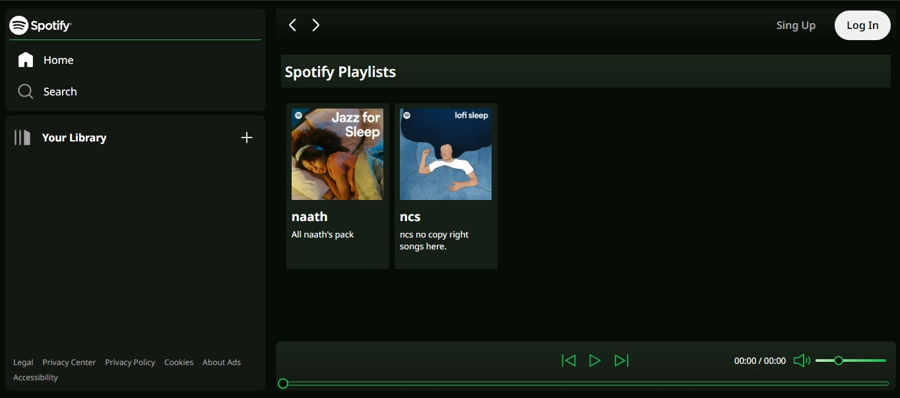
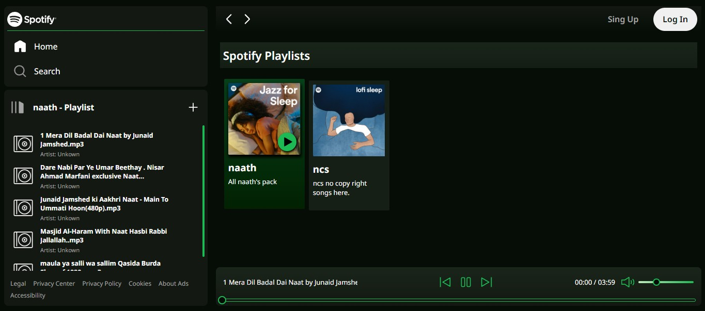
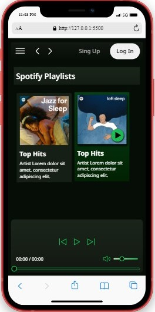
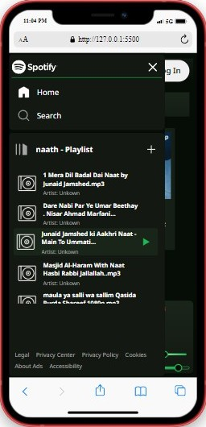
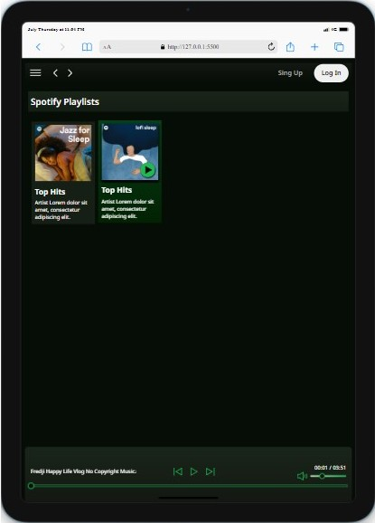

# 🎵 Spotify Clone With Responsiveness

A sleek and responsive Spotify clone built using **HTML**, **CSS**, and **JavaScript**. This UI replicates the look and feel of Spotify's core layout and adapts beautifully across desktops, tablets, and mobile devices.

---

## 🚀 Features

- ✅ Sidebar navigation for Home, Search, and Your Library
- ✅ Playlists with cards and artist info
- ✅ Custom playbar with controls and volume slider
- ✅ Scrollable song list with metadata
- ✅ Responsive design for mobile, tablet, and desktop
- ✅ Custom scrollbar and hover effects
- ✅ Supports dynamic playlist loading and playback

---

## 🖼️ Screenshots

### 💻 Desktop View – Default Layout



- Full sidebar
- Playlist cards displayed
- Minimal playbar at bottom

---

### 🎵 Playlist Loaded View



- Selected playlist shows songs in the sidebar
- Default song loaded into playbar

---

### 📱 Mobile View – Card Display



- Compact layout with menu toggle
- Cards stacked with clean spacing

---

### 📱 Mobile View – Playlist Opened



- Sidebar overlay slides in with song list
- All player controls remain accessible

---

### 💻 Tablet View – Balanced Layout



- Two playlist cards in grid
- Playbar at bottom remains visible

---

## 📁 Tech Stack

- **HTML5**
- **CSS3 (Custom properties & Media Queries)**
- **Vanilla JavaScript (ES6+)**

---

## 🛠️ Setup

```bash
git clone https://github.com/IrfanPatelIG/spotify-clone-repo-testing.git
cd spotify-clone-repo-testing
open index.html
